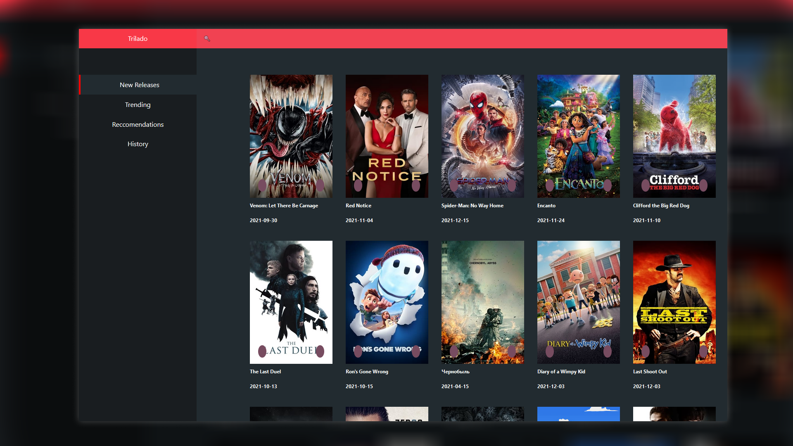

<h1 align="center">
  <br>
  Trilado
  <br>
</h1>

<h4 align="center">A film recommendation web app built using ReactJS.</h4>

<p align="center">
  <a href="#key-features">Key Features</a> •
  <a href="#To-Do">To Do</a> •
  <a href="#how-to-use">How To Use</a> •
  <a href="#related">Related</a> •
  <a href="#license">License</a>
</p>



## Key Features

* LivePreview - Make changes, See changes
  - Instantly see what your Markdown documents look like in HTML as you create them.
* Sync Scrolling
  - While you type, LivePreview will automatically scroll to the current location you're editing.
* GitHub Flavored Markdown  
* Syntax highlighting
* [KaTeX](https://khan.github.io/KaTeX/) Support
* Dark/Light mode
* Toolbar for basic Markdown formatting
* Supports multiple cursors
* Save the Markdown preview as PDF
* Emoji support in preview :tada:
* App will keep alive in tray for quick usage
* Full screen mode
  - Write distraction free.
* Cross platform
  - Windows, macOS and Linux ready.

## To Do

* Add recommendations page
 - Create component for displaying recommendations
* Introduction modal content/styling
 - initial model needs content adding


## How To Use

To clone and run this application, you'll need [Git](https://git-scm.com) and [Node.js](https://nodejs.org/en/download/) (which comes with [npm](http://npmjs.com)) installed on your computer. From your command line:

```bash
# Clone this repository
$ git clone https://github.com/dannyleewalasek/Trilad

# Go into the repository
$ cd Trilado

# Install dependencies
$ npm install

# Run the app
$ npm start
```

Note: If you're using Linux Bash for Windows, [see this guide](https://www.howtogeek.com/261575/how-to-run-graphical-linux-desktop-applications-from-windows-10s-bash-shell/) or use `node` from the command prompt.

## Credits

This software uses the following open source packages:

- [ReactJS](https://reactjs.org/)

## Related
- [YoKu e-commerce](https://github.com/dannyleewalasek/clothing-ecommerce) - An e-commerce clothing site
- [Trilado](https://github.com/dannyleewalasek/Trilado) - The front end of a film recommendation web app
- [Trilado-Backend](https://github.com/dannyleewalasek/Trilado-Backend) - The back end of the Trilado film recommendation web app

## License

MIT

---

> [dannyleewalasek.github.io](https://dannyleewalasek.github.io) &nbsp;&middot;&nbsp;
> GitHub [@dannyleewalasek](https://github.com/dannyleewalasek) &nbsp;&middot;&nbsp;

